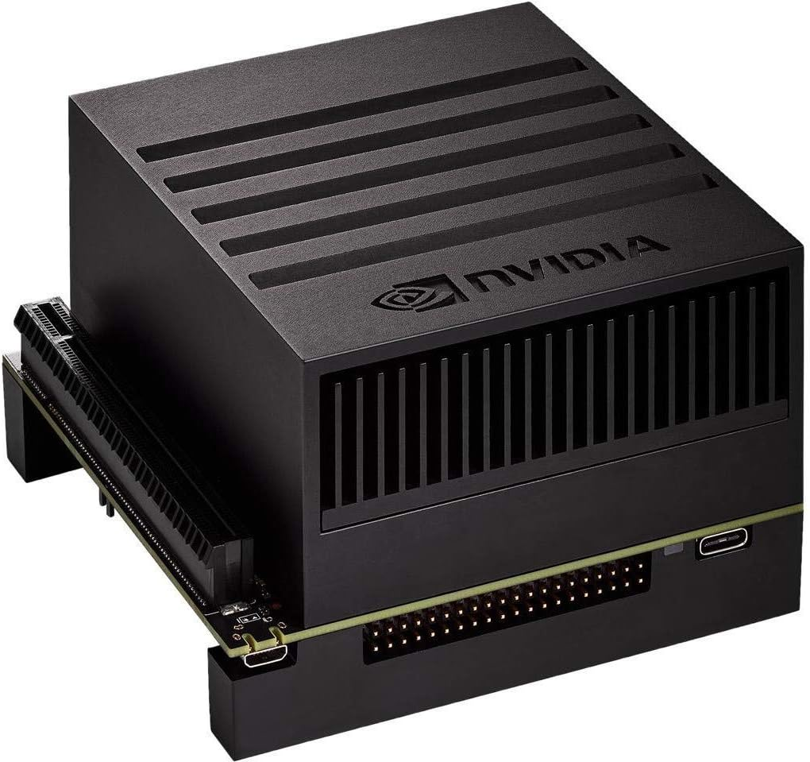

  
  &nbsp;&nbsp;&nbsp;&nbsp;
  

## Why This Fork?

NVIDIA's original Jetson lineup — Xavier, TX2, and Nano — remains widely deployed in production robotics, edge inference, and industrial automation. These modules are locked to **JetPack 5.x**, which ships **CUDA 11.4** and **nvcc 11.4**. NVIDIA does not provide newer CUDA toolkits for this hardware, and JetPack 6+ targets only the Orin generation.

Meanwhile, upstream ONNX Runtime has moved on. Newer releases assume CUDA 12+ features, use C++ constructs that trip nvcc 11.4 bugs, and reference FP8 data types that don't exist in CUDA 11.4 headers. The result: **ORT ≥ 1.17 will not build on JetPack 5.x without targeted patches**.

This fork bridges that gap. It carries a minimal, well-documented set of source-level fixes — applied on top of the official ORT v1.18 release — that restore compatibility with nvcc 11.4 and the JetPack 5.x SDK. Nothing is removed; the patches work around compiler limitations and missing constants so that the full CUDA and TensorRT execution providers build and run correctly on Xavier-class hardware.

**If you are running inference on a Jetson Xavier, TX2, or Nano module and need a current version of ONNX Runtime with GPU acceleration, this is the repo for you.**

**ONNX Runtime is a cross-platform inference and training machine-learning accelerator**.

**ONNX Runtime inference** can enable faster customer experiences and lower costs, supporting models from deep learning frameworks such as PyTorch and TensorFlow/Keras as well as classical machine learning libraries such as scikit-learn, LightGBM, XGBoost, etc. ONNX Runtime is compatible with different hardware, drivers, and operating systems, and provides optimal performance by leveraging hardware accelerators where applicable alongside graph optimizations and transforms. [Learn more &rarr;](https://www.onnxruntime.ai/docs/#onnx-runtime-for-inferencing)

**ONNX Runtime training** can accelerate the model training time on multi-node NVIDIA GPUs for transformer models with a one-line addition for existing PyTorch training scripts. [Learn more &rarr;](https://www.onnxruntime.ai/docs/#onnx-runtime-for-training)

## Get Started & Resources

* **General Information**: [onnxruntime.ai](https://onnxruntime.ai)

* **Usage documentation and tutorials**: [onnxruntime.ai/docs](https://onnxruntime.ai/docs)

* **YouTube video tutorials**: [youtube.com/@ONNXRuntime](https://www.youtube.com/@ONNXRuntime)

* [**Upcoming Release Roadmap**](https://github.com/microsoft/onnxruntime/wiki/Upcoming-Release-Roadmap)

* **Companion sample repositories**:
  - ONNX Runtime Inferencing: [microsoft/onnxruntime-inference-examples](https://github.com/microsoft/onnxruntime-inference-examples)
  - ONNX Runtime Training: [microsoft/onnxruntime-training-examples](https://github.com/microsoft/onnxruntime-training-examples)

## Builtin Pipeline Status

|System|Inference|Training|
|---|---|---|
|Windows|  ||
|Linux|    |  |
|Mac|||
|Android|||
|iOS|||
|Web|||
|Other|||

## Third-party Pipeline Status

|System|Inference|Training|
|---|---|---|
|Linux|||

## Data/Telemetry

Windows distributions of this project may collect usage data and send it to Microsoft to help improve our products and services. See the [privacy statement](docs/Privacy.md) for more details.

## Contributions and Feedback

We welcome contributions! Please see the [contribution guidelines](CONTRIBUTING.md).

For feature requests or bug reports, please file a [GitHub Issue](https://github.com/Microsoft/onnxruntime/issues).

For general discussion or questions, please use [GitHub Discussions](https://github.com/microsoft/onnxruntime/discussions).

## Code of Conduct

This project has adopted the [Microsoft Open Source Code of Conduct](https://opensource.microsoft.com/codeofconduct/).
For more information see the [Code of Conduct FAQ](https://opensource.microsoft.com/codeofconduct/faq/)
or contact [opencode@microsoft.com](mailto:opencode@microsoft.com) with any additional questions or comments.

## License

This project is licensed under the [MIT License](LICENSE).
